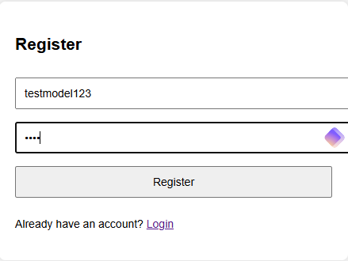
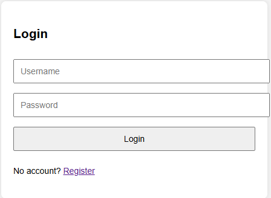
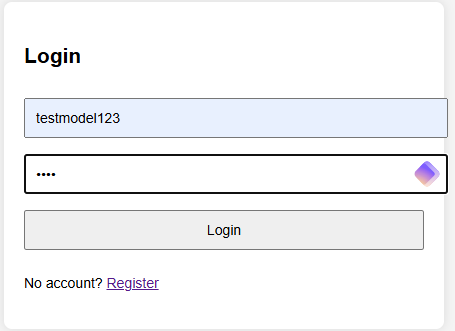
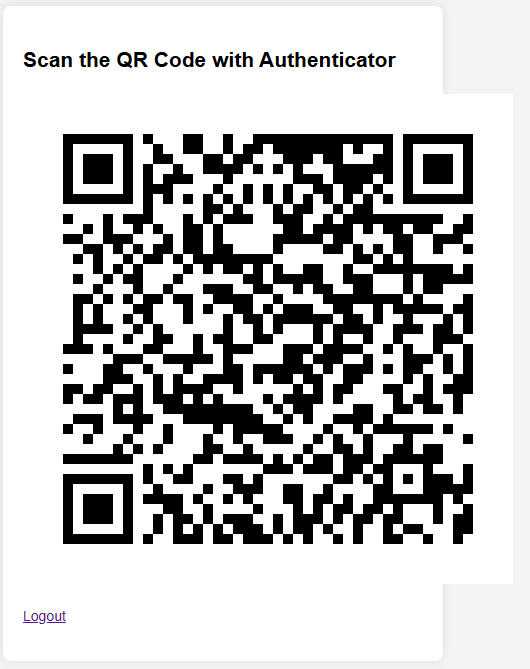
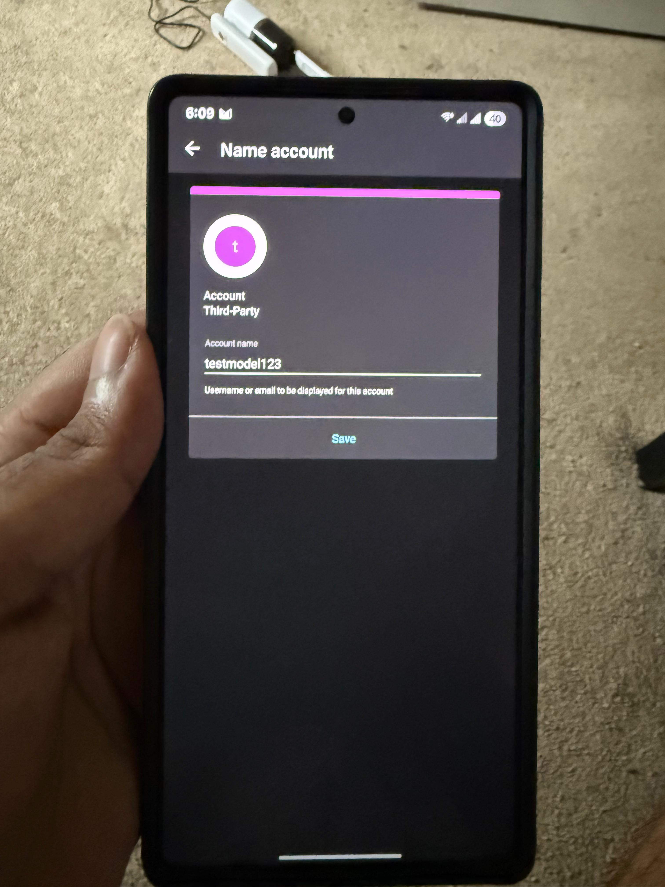
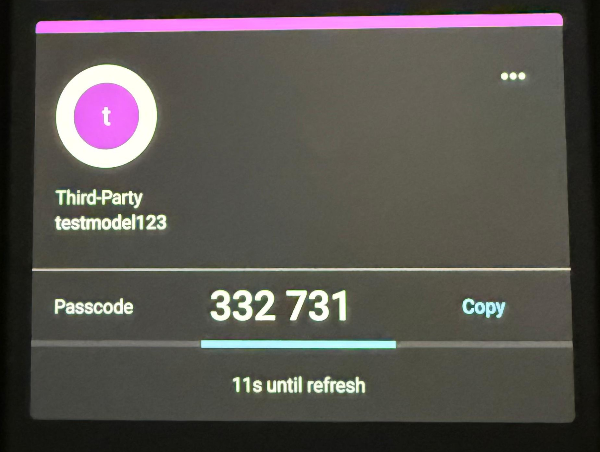
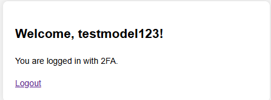
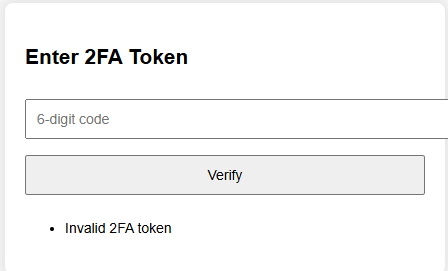

# 🔐 Two-Factor Authentication (2FA) System

This project implements a secure login system that combines traditional password-based authentication with Time-based One-Time Passwords (TOTP), providing an extra layer of protection for user accounts.

## 🛠️ Features

- User registration and login
- Passwords hashed with bcrypt
- TOTP-based 2FA using Google Authenticator or Authy
- QR code generation for easy 2FA setup
- Session management with Flask
- Basic HTML frontend with Bootstrap styling

## 🧱 Tech Stack

- Python (Flask)
- SQLite (lightweight database)
- `PyOTP` for TOTP generation/validation
- `qrcode` for QR code rendering
- `bcrypt` for secure password hashing
- HTML/CSS (Bootstrap)

## 🚀 How It Works

1. **User Registers**: Enters email and password (stored securely).
2. **2FA Setup**: A TOTP secret is generated and displayed as a QR code.
3. **User Scans QR**: Using Google Authenticator, the user adds the key.
4. **Login Process**:
   - Step 1: Enter email/password
   - Step 2: Enter the current 6-digit 2FA code from their app
5. **Verification**: The TOTP is validated using the shared secret.

## 🧪 Security Considerations

- Passwords are salted and hashed using `bcrypt`
- TOTP ensures dynamic codes every 30 seconds
- Prevents common attacks like credential stuffing, phishing, or session hijacking

<h2>📸 Screenshots</h2>

<h3>📝 Register Page</h3>

<h3>🔐 Login Page (Empty)</h3>

<h3>🔐 Login Page (Filled)</h3>

<h3>📷 QR Code Setup</h3>

<h3>📲 Duo App – Account Setup</h3>

<h3>🔄 Duo App – Code Display</h3>

<h3>✅ Successful Login</h3>

<h3>❌ Invalid 2FA Token</h3>

If you enter a wrong or expired token, the system will reject it and display an error like this:

